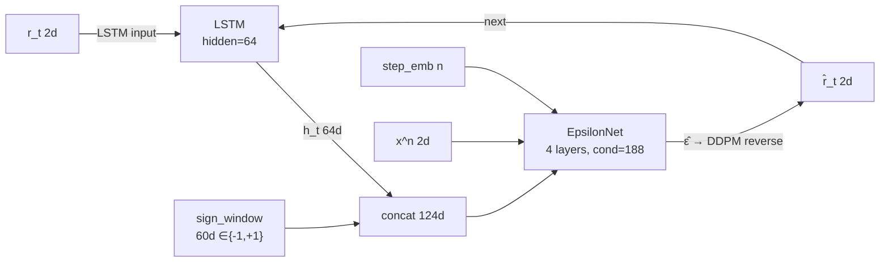
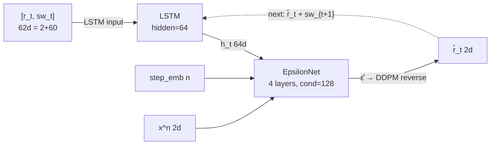

# sign_ablation – 符号情報の注入方法アブレーション実験

## 目的

「過去30日の符号ウィンドウ（30日×2資産=60次元のバイナリ列）をTimeGradに注入すると何が変わるか」を4条件で比較する。

**学習/生成の設計:**
- **random variants**: 学習時・生成時ともにランダム Ber(1/2) sign window
- **oracle variants**: 学習時は真の sign（データから引用）、生成時はランダム Ber(1/2)

この設計により「真のsignを見て学習したか否か」が唯一の違いとなる。

## 4つのアーキテクチャ

### cond_random・cond_oracle（EpsilonNet 条件注入）



*LSTM は符号を見ない。EpsilonNet が符号ウィンドウをワンショットで参照。*

### lstm_random・lstm_oracle（LSTM 入力注入）



*LSTM が符号の時系列を h_t に圧縮。EpsilonNet は h_t のみを条件とする。*

## 結果

| 指標 | **cond_rand** | **lstm_rand** | **cond_orc** | **lstm_orc** | timegrad | 実データ |
|---|---|---|---|---|---|---|
| 学習 best val | 0.675 | 0.675 | 0.683 | **0.695** | 0.575 | — |
| 尖度 γ₂ (SP500) | 4.78 ±1.88 | 3.89 ±0.64 | 4.01 ±0.51 | 4.19 ±0.92 | 4.57 | 18.7 |
| \|r\| ACF lag-3 | **0.138** ±0.09 | 0.051 ±0.09 | 0.055 ±0.08 | 0.017 ±0.05 | 0.060 | 0.220 |
| レバレッジ効果 | **−0.069** ±0.04 | −0.037 ±0.03 | −0.026 ±0.04 | −0.025 ±0.02 | −0.064 | −0.134 |
| 90日相関 std | 0.101 ±0.04 | 0.102 ±0.05 | 0.098 ±0.03 | 0.081 ±0.03 | 0.188 | 0.203 |

## 考察

### cond_random が最も良い指標を示した理由

- `|r|` ACF lag-3: **0.138**（timegrad 0.060、実データ 0.220 に最接近）
- レバレッジ効果: **−0.069**（全モデル中最良）
- val loss が 0.675 と他の ablation より良く、かつ分散が大きい（±1.88）

ランダム sign window が EpsilonNet の **正則化ノイズ**として機能し、
モデルが過剰に平均的な出力に収束することを防いだ可能性がある。
また sign window の多様性が DDPM の探索空間を広げ、fat tail 的な出力を生みやすくした可能性も考えられる。

### oracle variants が random より悪化した理由

- **cond_oracle**: val=0.683 > random 0.675。真のsignが追加条件として有用でないことを示す。
  EpsilonNetはsignの時系列構造を保持できない（LSTM を経由しない）ので、
  訓練期間特有のsignパターンを丸暗記 → 汎化しない。
- **lstm_oracle**: train=0.507 vs val=0.695（過学習）。
  LSTMがsignとリターンの訓練期間特有の相関を記憶 → val窓では逆効果。

### sign は EpsilonNet 経由で注入するほうが良い（ランダム限定）

ランダムsignをEpsilonNetに渡す `cond_random` が最もパフォーマンスが良かった。
これは「sign情報として有用なシグナルを学習したのではなく、ノイズ注入による正則化効果」の可能性が高い。
oracle版（真のsign）が期待どおり機能しなかったことも、この解釈を支持する。

## 学習結果サマリー

| mode | best val | early stop epoch | 特記事項 |
|---|---|---|---|
| cond_random | 0.6752 | 28 | ランダムノイズが正則化として有効か |
| lstm_random | 0.6747 | 29 | cond_random と同程度 |
| cond_oracle | 0.6831 | 17 | oracle でも改善なし（汎化しない） |
| lstm_oracle | 0.6946 | 16 | 顕著な過学習（train 0.507 vs val 1.05） |

## 使い方

```bash
# 全モード学習（順に実行）
for mode in cond_random lstm_random cond_oracle lstm_oracle; do
  python sign_ablation/train.py --mode $mode --epochs 200 --patience 15
done

# 全モード生成
python sign_ablation/generate.py

# 単一モード
python sign_ablation/train.py --mode cond_oracle
python sign_ablation/generate.py --mode cond_oracle
```
