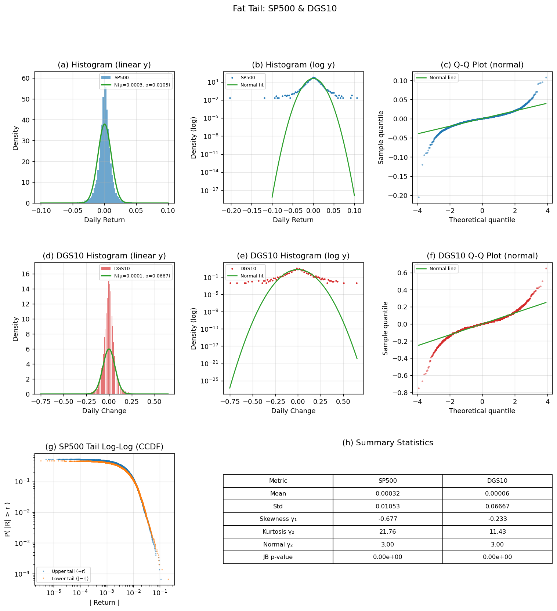
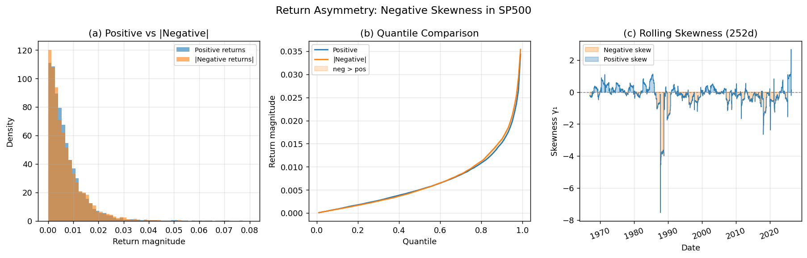
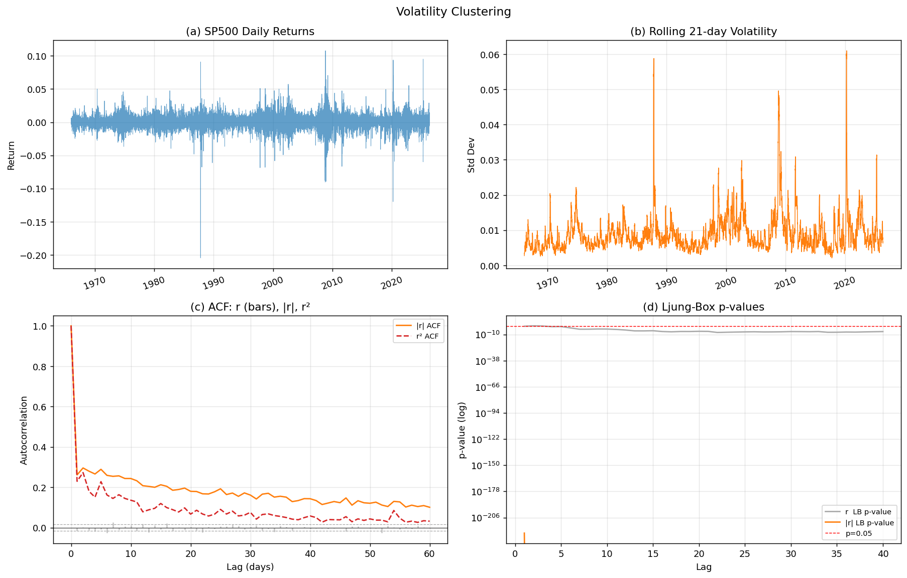
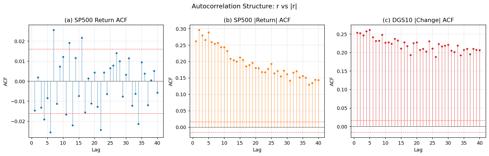
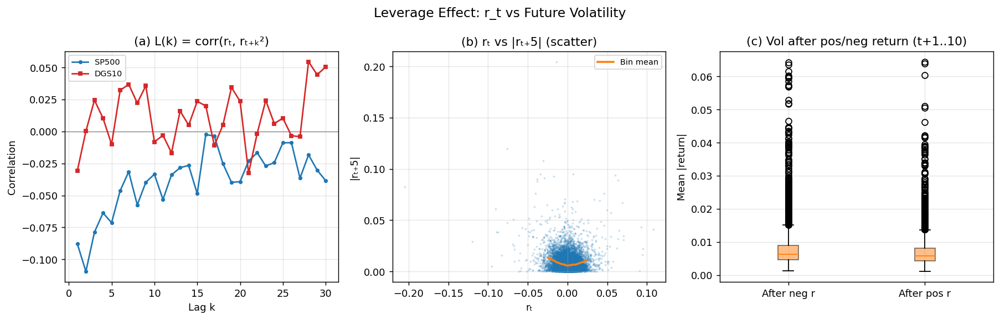
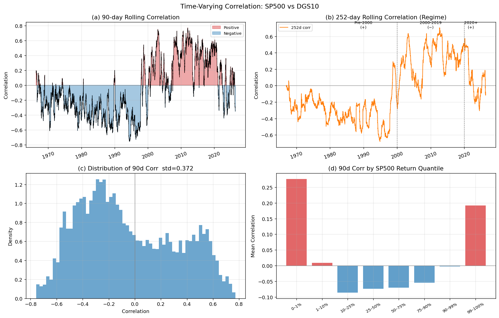
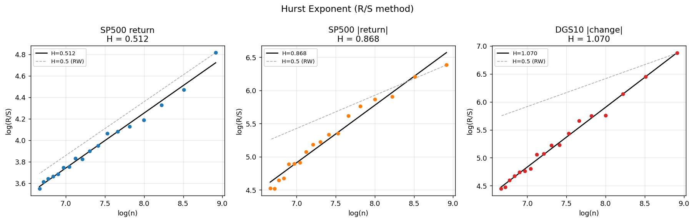
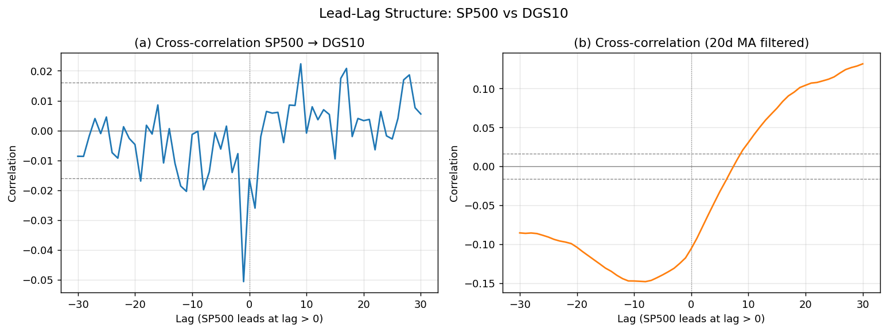
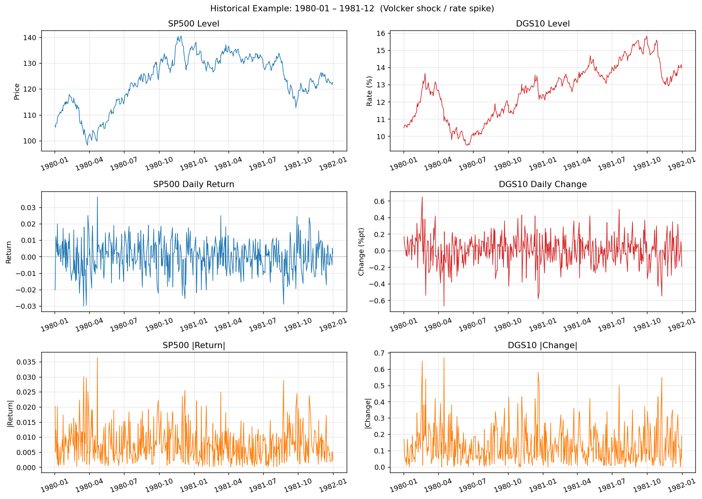
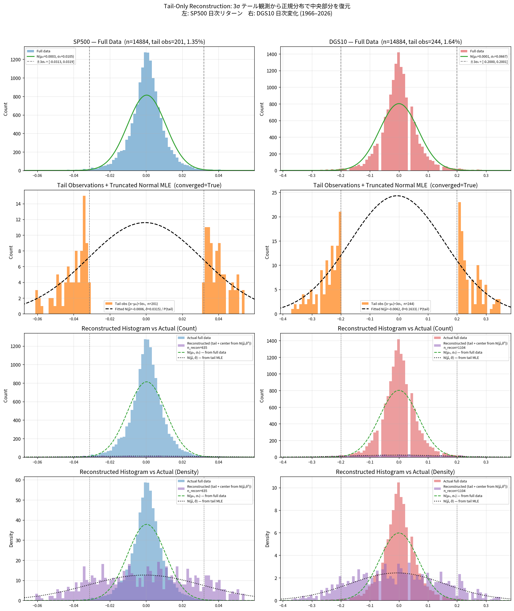

# Stylized Facts — 実データ検証

`output.csv`（S&P500 日次リターン `sp500` + 10年金利日次変化 `DGS10`、1966–2026年）に対する
Stylized Facts の定義・数式・実データ検証図のまとめ。

図の再生成: `python analyze_stylized_facts.py`

---

---

## 1. ファットテール（Fat Tail）
**適用**: SP500 ✓（強、γ₂≈21.8）／DGS10 ✓（中程度、γ₂≈11.4）

**定義**: 日次リターンの分布は正規分布より裾が厚い。極端なリターン（大暴落・急騰）が
正規分布の予測より頻繁に発生する。

**数式**

超過尖度（Excess Kurtosis）:

$$\gamma_2 = \frac{E[(r - \mu)^4]}{\sigma^4} - 3$$

正規分布では $\gamma_2 = 0$。実データでは $\gamma_2 \gg 0$。

Jarque-Bera 検定統計量:

$$\text{JB} = \frac{n}{6}\left(\gamma_1^2 + \frac{\gamma_2^2}{4}\right) \xrightarrow{H_0} \chi^2(2)$$

テール指数（Hill 推定量、上位 $k$ 個の超過値から）:

$$\hat{\alpha} = \left(\frac{1}{k}\sum_{i=1}^{k} \log \frac{X_{(i)}}{X_{(k+1)}}\right)^{-1}$$

実データでは $\alpha \approx 3\text{–}5$（べき乗則の指数）。正規分布は $\alpha = \infty$。

> **（注意）** 高尖度とファットテールは一見矛盾するが両立する。尖度が大きい分布は正規分布と比べて「肩（中心と裾の中間）」の確率を削り、中心付近と極端な裾の両方に再配分する。尖度を上げるのは実質的に「裾の外れ値の多さ」であり、「何もない日が多く、たまに大暴落・急騰がある」という金融リターンの構造に対応する。

**実データ値（1966–2026）**

| 指標 | SP500 | DGS10 | 正規分布 |
|------|-------|-------|---------|
| 尖度 γ₂ | ≈ 21.8 | ≈ 11.4 | 3.0 |
| 歪度 γ₁ | −0.68 | 0.06 | 0 |
| JB p値 | << 0.001 | << 0.001 | — |

図の見方:
- **(a)** 線形ヒストグラム: 正規フィット（緑）より実データの裾が広い
- **(b)** 対数ヒストグラム: 正規分布（直線的に減少）と比べ実データは緩やかに減少 → fat tail
- **(c)** Q-Qプロット: 両端が理論直線から外れる（上方・下方とも）→ 上下とも裾が重い
- **(d)** DGS10 も同様に fat tail を示す
- **(e)** 上昇・下落テールの CCDF（補累積分布）: べき乗則に近い直線
- **(f)** 数値統計: 正規分布の γ₂=3.0 に対し SP500≈21.8

---

## 2. リターン非対称性（Negative Skewness）
**適用**: SP500 ✓（γ₁≈−0.68）／DGS10 △（γ₁≈+0.06、ほぼ対称。クラッシュリスク・財務レバレッジは株式固有）

**定義**: 株式リターンは左歪み（negative skew）。大きな下落が大きな上昇より頻繁・大きい。
金利変化は概ね対称（γ₁ ≈ 0）。

**数式**

歪度:

$$\gamma_1 = \frac{E[(r - \mu)^3]}{\sigma^3}$$

$\gamma_1 < 0$（左歪み）: 下落幅の方が上昇幅より大きい傾向。

上下テール比:

$$\text{Tail Ratio} = \frac{|q_{1\%}|}{q_{99\%}} > 1 \text{ (左歪み)}$$

**解釈**: レバレッジ効果・投資家の損失回避行動・クラッシュリスクプレミアムが原因とされる。
ただし 2023–2025 年のような強気相場では一時的に正歪みになることもある。

図の見方:
- **(a)** 上昇リターン vs |下落リターン| の密度比較: 下落側（橙）の裾が厚い
- **(b)** 分位数比較: 高分位で下落側が上昇側を上回る（左歪みの視覚化）
- **(c)** 252日ローリング歪度: 長期的には負（橙領域）が多く、強気局面では正に転じる

---

## 3. ボラティリティ・クラスタリング（Volatility Clustering）
**適用**: SP500 ✓（強）／DGS10 ✓（あり。政策イベント等でボラがクラスタリングする）

**定義**: 大きなリターンの後には大きなリターンが続く傾向（符号は問わない）。
絶対リターン・二乗リターンに有意な正の自己相関が生じる。

**数式**

絶対リターンの自己相関:

$$\rho_k^{|r|} = \frac{\text{Cov}(|r_t|,\, |r_{t+k}|)}{\text{Var}(|r_t|)} > 0$$

ARCH 効果（Engle, 1982）:

$$r_t = \sigma_t \varepsilon_t, \quad \sigma_t^2 = \omega + \alpha r_{t-1}^2 + \beta \sigma_{t-1}^2$$

Ljung-Box 検定統計量（lag $m$）:

$$Q(m) = n(n+2)\sum_{k=1}^{m} \frac{\hat{\rho}_k^2}{n-k} \xrightarrow{H_0} \chi^2(m)$$

$|r|$ と $r^2$ に対して $p \ll 0.001$（強い ARCH 効果）。生リターン $r$ には $p > 0.05$ が理想（効率性）。

> **（注意）** ボラクラスタリング（$|r_t|$ に正の自己相関）とリターン自己相関の不存在（$r_t$ の符号は無相関）を合わせると、「次の動きが大きいことはわかるが、方向はわからない」ということ。GARCH モデルの $r_t = \sigma_t \varepsilon_t$（$\varepsilon_t$ i.i.d.）はこの構造を直接表現している。

図の見方:
- **(a)** リターン時系列: 大きな変動が固まって発生するクラスターが視認できる
- **(b)** 21日ローリングボラ: 高ボラ期間（リーマン、コロナ等）と低ボラ期間が交互に現れる
- **(c)** ACF比較: 生リターン（棒）は概ね信頼区間内、$|r|$（橙）・$r^2$（赤）は高lag でも有意に正
- **(d)** Ljung-Box p値: $|r|$ の p値は lag が増えても $10^{-3}$ 以下を維持

---

## 4. リターン自己相関の非存在
**適用**: SP500 ✓（弱形式効率性）／DGS10 △（金利は中央銀行政策で設定される面があり、厳密な EMH は成立しにくい）

**定義**: 弱形式効率市場仮説（EMH）: 過去のリターンから将来のリターンは予測できない。
すなわち生リターンの自己相関は統計的に有意でない。

**数式**

$$\rho_k^r = \frac{\text{Cov}(r_t,\, r_{t+k})}{\text{Var}(r_t)} \approx 0 \quad \forall k \geq 1$$

95% 信頼区間: $\pm 1.96 / \sqrt{n}$

**重要な対比**: $\rho_k^r \approx 0$（リターン）だが $\rho_k^{|r|} > 0$（絶対リターン）という非線形依存性。

図の見方:
- **(a)** SP500 リターン ACF: ほぼ信頼区間（赤破線）内 → 線形予測不可
- **(b)** SP500 |リターン| ACF: 多くの lag で信頼区間を超える → 非線形依存あり
- **(c)** DGS10 |変化| ACF: 同様にボラ持続性を示す

---

## 5. レバレッジ効果（Leverage Effect）
**適用**: SP500 ✓（強、lag1–5 平均≈−0.09）／DGS10 ✗（財務レバレッジのメカニズムは株式固有。金利には直接適用されない）

**定義**: 株式リターンの下落が将来のボラティリティ上昇と負の相関を持つ。
名前の由来: 株価下落 → 財務レバレッジ（負債/株式比）上昇 → リスク増大。

**数式**

リード・ラグ相関（Black, 1976; Christie, 1982）:

$$L(k) = \text{corr}(r_t,\, r_{t+k}^2) < 0 \quad (k \geq 1)$$

あるいは:

$$L(k) = \text{corr}(r_t,\, |r_{t+k}|) < 0$$

**実データ値**: SP500 で $L(k) \approx -0.05$ 〜 $-0.13$（lag 1–5 平均）。
DGS10 では効果が弱い（$L(k) \approx -0.04$）。

図の見方:
- **(a)** $L(k)$ vs $k$: SP500（青）は lag 1 から明確に負。DGS10（赤）は弱い
- **(b)** $r_t$ vs $|r_{t+5}|$ 散布図: ビン平均（橙線）が右から左にかけて増加 → 負リターン後の高ボラ
- **(c)** 正/負リターン後のボラ比較: 負リターン後（左箱）の方がボラ中央値が高い

---

## 6. 時変相関（Time-Varying Correlation）
**適用**: SP500・DGS10 共通 ✓（2系列間のクロスアセット特性）

**定義**: SP500 と DGS10 の相関は時間とともに変化する。
市場レジームによって符号が変わる（株債相関のフリップ）。

**数式**

ローリング相関（窓幅 $w$）:

$$\rho_t^{(w)} = \frac{\sum_{s=t-w+1}^{t}(r_s^\text{sp} - \bar{r}^\text{sp})(r_s^\text{dgs} - \bar{r}^\text{dgs})}{\sqrt{\sum(r_s^\text{sp}-\bar{r}^\text{sp})^2 \sum(r_s^\text{dgs}-\bar{r}^\text{dgs})^2}}$$

時変性の指標: $\text{std}(\rho_t^{(90)})$

**レジーム変化の実例**

| 期間 | 平均相関 | 背景 |
|------|---------|------|
| 1966–1999 | 正（+0.2 前後） | インフレ時代：株・金利が同方向に動く |
| 2000–2019 | 負（−0.3 前後） | 低インフレ時代：フライト・トゥ・クオリティ |
| 2020–2026 | 正に回帰（+0.2 前後） | インフレ再燃・FRB 利上げ局面 |

図の見方:
- **(a)** 90日ローリング相関の時系列: 正（赤）・負（青）の切り替わりが明瞭
- **(b)** 252日ローリング相関: 3つのレジームが破線で区切られる
- **(c)** 相関値の分布: 広く分布（std ≈ 0.37）→ 時変性が大きい
- **(d)** SP500 リターン分位別の平均相関: 急落局面（左端）と急騰局面（右端）で符号が異なる

---

## 7. ハースト指数（Hurst Exponent）
**適用**: SP500 ✓／DGS10 ✓（|r| の長期記憶は両方に存在）

**定義**: 時系列の長期記憶・フラクタル性を定量化する指標。
$H > 0.5$: 持続性（トレンドフォロー）、$H = 0.5$: ランダムウォーク、$H < 0.5$: 平均回帰。

**数式**

R/S（Rescaled Range）法:

$$\frac{R(n)}{S(n)} \propto n^H$$

ここで $R(n) = \max_{1 \leq t \leq n} W_t - \min_{1 \leq t \leq n} W_t$（累積偏差の範囲）、$S(n)$ は標準偏差。
$\log(R/S)$ を $\log(n)$ に回帰した傾きが $H$。

**実データ値**

| 系列 | H（R/S） | 解釈 |
|------|---------|------|
| SP500 リターン | ≈ 0.50 | ランダムウォークに近い（弱形式効率性） |
| SP500 \|リターン\| | ≈ 0.64 | 持続性あり（ボラクラスタリングと対応） |
| DGS10 \|変化\| | ≈ 0.62 | 同様 |

図の見方:
- 各パネルで点が $\log(R/S)$ vs $\log(n)$、実線がフィット直線（傾き $= H$）
- 破線（$H=0.5$）が RW の基準線。$|r|$ はそれより急な傾き → 長期記憶あり

---

## 8. リード・ラグ現象（Lead-Lag）
**適用**: SP500・DGS10 共通 ✓（2系列間のクロスアセット特性）

**定義**: SP500 と DGS10 の間に時間的な先行・遅行関係が存在する。
情報伝達の非対称性や市場の反応速度の差を反映する。

**数式**

相互相関関数（CCF）:

$$\text{CCF}(k) = \text{corr}(r_t^\text{sp},\, r_{t+k}^\text{dgs})$$

$k > 0$（正ラグ）: SP500 が DGS10 に先行。$k < 0$: DGS10 が先行。

リード・ラグ非対称性スコア:

$$\Delta = \max_{k>0}|\text{CCF}(k)| - \max_{k>0}|\text{CCF}(-k)|$$

$\Delta > 0$: SP500 リードが強い。

図の見方:
- **(a)** 生リターンの相互相関: ほぼ全 lag で信頼区間内（短期では予測困難）
- **(b)** 20日移動平均後: 中期トレンドレベルでの先行関係が現れる場合がある

---

## 9. 特徴量一覧

### カテゴリ A: 分布特性

| 特徴量 | 定義・算出 | 実データ目安 (SP500) | 実データ目安 (DGS10) |
|--------|-----------|---------------------|---------------------|
| 尖度 γ₂ | $E[(r-\mu)^4]/\sigma^4$ | 12〜20 | 3〜5 |
| 歪度 γ₁ | $E[(r-\mu)^3]/\sigma^3$ | −1〜0（全期間） | −0.1〜0 |
| Jarque-Bera p | 正規性検定 | << 0.01 | 0.01〜0.05 |
| テール指数 α | Hill 推定（下側 5%）| 3〜4 | — |
| 上下テール比 | $\|q_{1\%}\| / q_{99\%}$ | > 1（左歪み） | ≈ 1 |

---

### カテゴリ B: 自己相関・記憶性

| 特徴量 | 定義・算出 | 実データ目安 (SP500) |
|--------|-----------|---------------------|
| r ACF lag-k | $\text{corr}(r_t, r_{t+k})$ | ≈ 0 |
| \|r\| ACF lag-k | $\text{corr}(|r_t|, |r_{t+k}|)$ | 0.10〜0.20（lag1） |
| r² ACF lag-k | $\text{corr}(r_t^2, r_{t+k}^2)$ | 0.10〜0.25（lag1） |
| Ljung-Box p（r, lag10） | 弱形式効率性 | 0.01〜0.10 |
| Ljung-Box p（\|r\|, lag10） | ボラティリティ持続性 | << 0.001 |
| ハースト指数 H（リターン）| R/S 法 | 0.48〜0.52 |
| ハースト指数 H（\|r\|）| R/S 法 | 0.60〜0.70 |

---

### カテゴリ C: クロスアセット特性

| 特徴量 | 定義・算出 | 実データ目安 |
|--------|-----------|------------|
| ローリング相関 std（90d） | $\text{std}(\rho_t^{(90)})$ | 0.35〜0.40（全期間） |
| 相関の非対称性 | $\|\text{corr}(\le 1\%) - \text{corr}(\ge 99\%)\|$ | > 0.1 |
| レバレッジ効果 lag1–5 | $\text{mean}_{l=1..5}\, L(l)$ | −0.10〜−0.05（SP500）|
| リード・ラグ非対称性 $\Delta$ | CCF の正/負ラグ最大値差 | 定性確認 |
| Lévy area $A^{12}$ | $\frac{1}{2}(\int X^1 dX^2 - \int X^2 dX^1)$ | 定性的 |
| テール依存係数 λ_L | コピュラ推定（下側） | λ_L > λ_U（暴落の同時性） |

---

### カテゴリ D: 複雑性・構造変化

| 特徴量 | 定義 | 解釈 |
|--------|------|------|
| パス・シグネチャ（次数 N） | 反復積分列 $S(X)_1, S(X)_2, \ldots$ | 軌跡の形状を座標自由に記述 |
| MFDFA スペクトル幅 Δh | $h(q_{\max}) - h(q_{\min})$（多重フラクタル DFA） | 大 → 複雑なスケーリング |
| Permutation Entropy | 近傍の順序パターン分布 | 小 → 秩序的・低エントロピー |
| Variance Ratio（VR） | $\text{Var}(r_k) / (k \cdot \text{Var}(r_1))$ | 1 からの乖離 → 非ランダムウォーク |

---

---

## 10. 実データ例：1980–1981年（Volcker ショック）

ボルカーFRB議長による急激な利上げ局面（DGS10 が 8% → 16% に急騰）を例として、水準・リターン・絶対値リターンの3層で実データの構造を確認する。

- **水準（上段）**: SP500 は横ばい〜緩やかな下落、DGS10 は急騰して高止まり
- **リターン（中段）**: 両系列とも高ボラ期間と低ボラ期間が交互に現れる（ボラクラスタリング）
- **絶対値リターン（下段）**: 大きなスパイクが固まって発生しており、長期記憶・クラスタリングが視覚的に確認できる。DGS10 の絶対変化は SP500 より大きく乱高下しており、利上げ局面での金利ボラが突出して高い

---

---

## 補足: テール観測からの正規分布復元実験

**コード**: `tail_reconstruction.py` / **図の再生成**: `/home/u00121/.venv/bin/python tail_reconstruction.py`

### 検証の動機

Section 1（ファットテール）ではテール指数・尖度・Q-Qプロットでファットテールを確認した。
ここでは「もしテール部分が正規分布に従うとしたら、そこから復元された中央部分はどのように見えるか」を
**切断正規分布の MLE** によって直接検証する。

### 手法

**Step 1 — 閾値の決定（固定化）**

全データから暫定パラメータ $(\hat{\mu}_0, \hat{\sigma}_0)$ を推定し、閾値を固定する：

$$t_{\text{lo}} = \hat{\mu}_0 - 3\hat{\sigma}_0, \qquad t_{\text{hi}} = \hat{\mu}_0 + 3\hat{\sigma}_0$$

これによって「閾値がパラメータに依存する」循環問題を回避する。

**Step 2 — 切断正規分布 MLE**

テール観測値 $\mathcal{T} = \{x_i : x_i < t_{\text{lo}} \text{ または } x_i > t_{\text{hi}}\}$ に対する条件付き対数尤度を最大化：

$$\ell(\mu, \sigma) = \sum_{x_i \in \mathcal{T}} \log \frac{\phi\!\left(\frac{x_i - \mu}{\sigma}\right)}{\sigma} - |\mathcal{T}| \cdot \log \underbrace{\left[\Phi\!\left(\frac{t_{\text{lo}}-\mu}{\sigma}\right) + 1 - \Phi\!\left(\frac{t_{\text{hi}}-\mu}{\sigma}\right)\right]}_{P(\text{tail}\,|\,\mu,\sigma)}$$

分母の項は「テール領域に落ちる確率」であり、観測選択バイアスを補正する。

**Step 3 — 中央部分の復元**

推定した $(\hat{\mu}, \hat{\sigma})$ から、テール観測数 $|\mathcal{T}|$ に対応した比率で中央部分をサンプリング：

$$n_{\text{center}} = |\mathcal{T}| \times \frac{P(\text{center}\,|\,\hat{\mu},\hat{\sigma})}{P(\text{tail}\,|\,\hat{\mu},\hat{\sigma})}, \qquad \text{center} \sim \text{TruncNorm}(\hat{\mu},\hat{\sigma},\,t_{\text{lo}},t_{\text{hi}})$$

### 数値結果（1966–2026, n=14,884）

| 指標 | SP500 | DGS10 |
|------|-------|-------|
| 全データ $\hat{\sigma}_0$ | 0.01053 | 0.06668 |
| テール観測数 $|\mathcal{T}|$ | 201 (1.35%) | 244 (1.64%) |
| 正規分布の期待テール比率 | 0.27% | 0.27% |
| **テール観測の超過倍率** | **5.0×** | **6.1×** |
| MLE 推定 $\hat{\sigma}$ | 0.03154 | 0.16334 |
| **$\hat{\sigma} / \hat{\sigma}_0$ の比** | **3.0×** | **2.45×** |

### 図の見方

各列（左: SP500、右: DGS10）について：

- **(上段)** 全データのヒストグラムと正規フィット $N(\hat{\mu}_0, \hat{\sigma}_0^2)$。灰色破線が $\pm 3\hat{\sigma}_0$ の閾値。
- **(中段)** テール観測値のみ（橙色）と切断正規 MLE によるフィット曲線（黒破線）。
  MLE は「テール領域での条件付き密度」を最大化するため、テール領域の形状を最もよく再現するように $(\hat{\mu}, \hat{\sigma})$ を決定する。
- **(下段)** 「復元ヒストグラム」（紫: テール観測値 ＋ $N(\hat{\mu}, \hat{\sigma}^2)$ からサンプリングした中央部分）vs 実際の全データ（青/赤）。
  復元ヒストグラムは実データより**著しく広く・平坦**になる。

### 解釈と示唆

> **テールと中央は正規分布として整合しない。**

もしテール部分が正規分布に従うとすれば、そのパラメータは $\hat{\sigma} \approx 3\hat{\sigma}_0$（SP500）を要求する。
しかし実際の中央部分の広がりは $\hat{\sigma}_0$ 程度であり、テールの暗示する正規分布とは大きく乖離している。

- **テール超過 5–6× (>3σ)**: 正規分布では 0.27% のはずの観測が実際には 1.35–1.64% 存在する
- **スケール不整合 $\hat{\sigma}/\hat{\sigma}_0 \approx 2.5$–$3$**: テールを正規として説明するには中央を3倍広くする必要がある
- **結論**: ファットテールは「スケールが大きい正規分布」では説明できず、
  正規分布とは質的に異なる重み付け（べき乗則的な裾）を持つ分布が必要であることが視覚的に確認できる

これは尖度の解釈（Section 1 の注意欄）と一致する：
「裾の外れ値の多さ」が中心の形状と独立に存在しており、両者を同時に正規分布一つで記述することは原理的に不可能である。

---

---

## 補足: リターン符号の分布・自己相関の時期別解析

**コード**: `output.csv` を 6 年ごと 10 区間に分割し、符号分布・ACF・連長を集計（1966–2026）。

### 分析結果

| 期間 | SP500 正% | SP500 負% | SP500 ACF1 | SP500 連長mean | DGS10 正% | DGS10 負% | DGS10 ゼロ% | DGS10 ACF1 | DGS10 連長mean |
|---|---|---|---|---|---|---|---|---|---|
| 1966–1971 | 51.4 | 47.8 | **+0.211** | 2.50 | 47.5 | 40.0 | 12.5 | **+0.208** | 2.07 |
| 1972–1977 | 48.8 | 50.7 | **+0.150** | 2.32 | 42.7 | 38.6 | 18.8 | **+0.184** | 1.86 |
| 1978–1983 | 51.7 | 47.8 | **+0.075** | 2.15 | 49.1 | 43.4 |  7.5 | **+0.058** | 1.90 |
| 1984–1989 | 54.3 | 45.4 | +0.011 | 2.03 | 43.6 | 48.4 |  8.0 | +0.061 | 1.83 |
| 1990–1995 | 53.1 | 46.8 | +0.019 | 2.04 | 43.2 | 47.0 |  9.8 | +0.064 | 1.80 |
| 1996–2001 | 52.1 | 47.8 | +0.018 | 2.04 | 45.9 | 46.3 |  7.7 | +0.071 | 1.86 |
| 2002–2007 | 53.4 | 46.6 | **−0.090** | 1.84 | 43.5 | 47.9 |  8.6 | −0.011 | 1.76 |
| 2008–2013 | 54.9 | 45.1 | **−0.031** | 1.95 | 45.4 | 48.5 |  6.1 | −0.003 | 1.77 |
| 2014–2019 | 54.6 | 45.4 | **−0.057** | 1.91 | 43.4 | 47.0 |  9.6 | **−0.058** | 1.64 |
| 2020–2025 | 54.4 | 45.6 | **−0.044** | 1.93 | 47.4 | 45.6 |  6.9 | −0.009 | 1.77 |

### 主要な発見

**1. SP500 符号 ACF1 の構造変化（最重要）**

符号の自己相関が 2001 年前後で**正→負**に転換している。

- **1966〜1983**: ACF1 = +0.07〜+0.21（**モメンタム**：上昇日の翌日も上昇しやすい）
- **1984〜2001**: ACF1 ≈ 0（ほぼランダム）
- **2002〜現在**: ACF1 = −0.03〜−0.09（**平均回帰**：上昇日の翌日は下落しやすい）

この変化は弱形式効率性の高まり（アルゴリズム取引の普及）と一致する。
また連長の平均も 2.50（1966年代）から 1.84（2002年以降）へ縮小しており、符号の持続性が失われている。

**2. DGS10 のゼロ比率の時代変化**

金利変化ゼロの割合が 1972〜1977 年（18.8%）から 2008〜2013 年（6.1%）へ大きく低下。
高インフレ・Volcker ショック期（1978–1983）は金利が毎日動いた（ゼロ 7.5%）のに対し、
1970 年代は政策の硬直性で変化なしの日が多かった。

**3. SP500 正率の長期トレンド**

全期間で 52.89% 正（全体平均）だが、2002 年以降は 53〜55% と高め。
強気相場（2009〜2021）の影響で正率が上昇し、これが ACF1 の平均回帰と共存している。

### モデルへの含意

- **符号 ACF1 が時期によって大きく異なる**ことは、固定した Bernoulli(0.5) モデルでは不十分であることを示す
- 1966〜1983 年初期から生成する際（`--start_date 1966-01-03`）はモメンタム的な符号構造が必要
- 2002 年以降の生成には平均回帰的な符号構造が必要
- **レジームチェンジを跨ぐ長期生成**では符号 ACF の符号が途中で変わることに注意が必要

---

### パス・シグネチャ補足

ラフパス理論（Lyons, 1998）に基づく特徴量。$d$ 次元パス $X = (X^1, X^2)$ のシグネチャ:

$$S(X)^{i_1,\ldots,i_k}_{0:T} = \sum_{0 \le t_1 < \cdots < t_k \le T} \Delta X^{i_1}_{t_1} \cdots \Delta X^{i_k}_{t_k}$$

- **1次**: 各次元の総変化量
- **2次（Lévy area）**: $A^{12} = \frac{1}{2}\!\left(\int X^1 dX^2 - \int X^2 dX^1\right)$ — 先行・遅行の非対称性を連続時間で捉える
- **距離指標**: 実データと生成データのシグネチャノルム差で軌跡の形を定量比較
