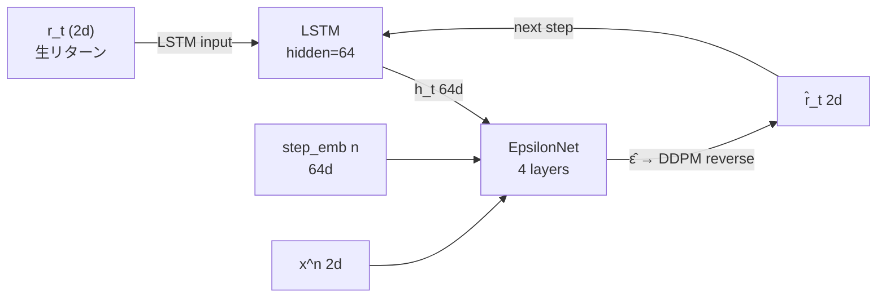

# timegrad — LSTM + DDPM (TimeGrad)

## アーキテクチャ



## 概要

Rasul et al. (2021) "Autoregressive Denoising Diffusion Models for Multivariate Probabilistic Time Series Forecasting" の実装です。

LSTM が過去のリターン列を逐次的に記憶し、その hidden state を条件として DDPM が次の1営業日分の `x_t^0 = [sp500_ret, dgs10_change]` を生成します。生成したステップを即座に LSTM に戻す自己回帰ループにより、任意の長さのパスを生成できます。

### diffusion との主な違い

| | diffusion | timegrad |
|---|---|---|
| 生成単位 | window 長の系列を一括 | 1営業日ずつ |
| 長期相関 | チャンク間は水準2値のみ引き継ぎ | LSTM hidden state で全履歴を保持 |
| DDPM 対象の次元 | 252 次元（系列全体） | 2 次元（1ステップ分） |
| 拡散ステップ数 | 1000（高次元のため多め） | 100（2次元のため少なくて十分） |

## ファイル構成

```
timegrad/
├── train.py     # 学習・パス生成 CLI
├── dataset.py   # データ読み込み・正規化・ウィンドウ化
└── model.py     # LSTM + EpsilonNet + DDPM スケジューラ
```

## 学習

```bash
python timegrad/train.py train \
    --csv output.csv \
    --epochs 200
```

| オプション | デフォルト | 説明 |
|---|---|---|
| `--csv` | `output.csv` | 学習データ CSV |
| `--epochs` | `200` | エポック数 |
| `--context_length` | `252` | RNN に与える過去の営業日数（約1年） |
| `--pred_length` | `21` | 1サンプルあたりの学習予測長（約1ヶ月） |
| `--stride` | `1` | ウィンドウ開始位置の選択間隔（候補を何日おきに作るか） |
| `--val_method` | `chronological` | val 分割方式: `chronological`=末尾固定 / `random_disjoint`=ターゲット期間が重複しないランダム選択 |
| `--seed` | `42` | `random_disjoint` 時のランダムシード |
| `--batch` | `64` | バッチサイズ |
| `--lr` | `1e-3` | 学習率 |
| `--diff_steps` | `100` | DDPM の拡散ステップ数 |
| `--rnn_hidden` | `64` | LSTM の隠れ次元 |
| `--hidden_dim` | `128` | EpsilonNet の隠れ次元 |
| `--n_layers` | `8` | EpsilonNet の残差ブロック数 |
| `--ckpt` | `timegrad/ckpt_best.pt` | チェックポイント保存先 |

## 学習ログの見方

```
epoch    1/200  train=0.69  val=0.70
```

| 項目 | 内容 |
|---|---|
| `train` | 学習データ（全ウィンドウの90%、ランダム選択）での DDPM ノイズ予測の MSE loss |
| `val` | 検証データ（残り10%のウィンドウ、ランダム選択）での同 loss。モデルの汎化性能の指標 |

- `chronological`（デフォルト）: 末尾 10% を val に使用。時系列的に正しい評価だが、val 分布が train と異なる可能性がある
- `random_disjoint`: 全体からターゲット期間が互いに重複しない窓をランダムに選択。val/train の分布が揃うが、データリークに注意

`val` が下がり続ける → 汎化が改善。`train` だけ下がり `val` が上昇し始める → 過学習。チェックポイントは `val` が最小を更新したときのみ保存されます。

## パス生成

```bash
python timegrad/train.py generate \
    --ckpt timegrad/ckpt_best.pt \
    --csv output.csv \
    --n_paths 5 \
    --business_days 504 \
    --out timegrad/generated_paths.csv
```

| オプション | デフォルト | 説明 |
|---|---|---|
| `--ckpt` | `timegrad/ckpt_best.pt` | 使用するチェックポイント |
| `--csv` | `output.csv` | 正規化統計・RNN コンテキスト用の実績 CSV |
| `--n_paths` | `100` | 生成するパス本数 |
| `--business_days` | `504` | 生成する営業日数（252 ≈ 1年、504 ≈ 2年） |
| `--out` | `timegrad/generated_paths.csv` | 出力 CSV ファイル名 |

出力形式は `diffusion` と同一のため、`compare_paths.py` でそのまま可視化できます。

## モデルアーキテクチャ

```
TimeGradModel
├── LSTM (input_dim=2, hidden_dim=rnn_hidden)
│     過去のリターン列 x_{1:t-1} を処理して hidden state h_t を生成
└── EpsilonNet ε_θ(x^n, n, h_t)
      Input : x^n ∈ R^2 (noisy return), n (拡散ステップ), h_t (LSTM hidden)
      Hidden: Linear → N × ResidualBlock (FiLM conditioning)
      Output: ε̂ ∈ R^2 (予測ノイズ)

学習: teacher forcing で context → targets を一括処理
生成: 1ステップごとに DDPM reverse → LSTM 更新 の自己回帰ループ
```
