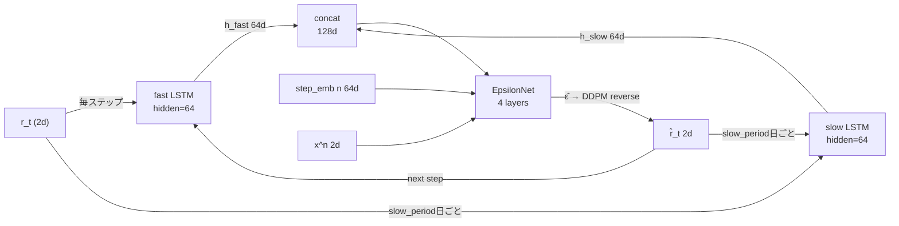

# timegrad_ms — TimeGrad Multi-Scale LSTM

## アーキテクチャ



## 概要

Clockwork RNN 的アプローチで、**異なる時間スケールの LSTM 2つ**を並列に走らせます。

- **fast_rnn**（1日スケール）: 毎ステップ更新。直近の短期トレンド・ボラティリティを捉える
- **slow_rnn**（`slow_period` 日スケール、デフォルト21日 ≈ 1ヶ月）: `slow_period` 日ごとに更新。月次レジーム・長期トレンドを捉える

EpsilonNet は $[h_\text{fast}, h_\text{slow}]$ の連結を条件に各ステップの returns を生成します。

### timegrad との主な違い

| | timegrad | timegrad_ms |
|---|---|---|
| RNN | LSTM 1つ | fast LSTM + slow LSTM |
| 長期情報 | h_t に暗黙的に含む | h_slow で明示的に分離 |
| EpsilonNet 条件 | $h_t$ | $[h_\text{fast}, h_\text{slow}]$ |
| パラメータ数 | ~118K | ~135K（LSTM 2つ分増） |

## ファイル構成

```
timegrad_ms/
├── train.py    # 学習・パス生成 CLI
├── dataset.py  # データ読み込み・正規化・ウィンドウ化
└── model.py    # MultiScaleTimeGradModel
```

## 学習

```bash
python timegrad_ms/train.py train --csv output.csv --epochs 200
```

| オプション | デフォルト | 説明 |
|---|---|---|
| `--csv` | `output.csv` | 学習データ CSV |
| `--epochs` | `200` | エポック数 |
| `--slow_ctx` | `252` | slow LSTM に与える過去の営業日数（長いウィンドウ、≈1年） |
| `--fast_ctx` | `63` | fast LSTM に与える過去の営業日数（短いウィンドウ、≈3ヶ月） |
| `--pred_length` | `21` | 1サンプルあたりの学習予測長 |
| `--stride` | `1` | ウィンドウ開始位置の選択間隔 |
| `--fast_hidden` | `64` | fast LSTM の隠れ次元 |
| `--slow_hidden` | `64` | slow LSTM の隠れ次元 |
| `--slow_period` | `21` | slow LSTM の更新間隔（営業日） |
| `--hidden_dim` | `64` | EpsilonNet の隠れ次元 |
| `--n_layers` | `4` | EpsilonNet の残差ブロック数 |
| `--dropout` | `0.1` | Dropout 率 |
| `--val_method` | `chronological` | val 分割方式 |
| `--ckpt` | `timegrad_ms/ckpt_best.pt` | チェックポイント保存先 |

## パス生成

```bash
python timegrad_ms/train.py generate \
    --ckpt timegrad_ms/ckpt_best.pt \
    --csv output.csv \
    --n_paths 1 \
    --business_days 504 \
    --out timegrad_ms/generated_paths.csv
```

## モデルアーキテクチャ

```
MultiScaleTimeGradModel
├── fast_rnn : LSTM(input=2, hidden=fast_hidden)
│              直近 fast_ctx 日（デフォルト63日 ≈ 3ヶ月）を処理
│              毎ステップ更新 → h_fast_t
├── slow_rnn : LSTM(input=2, hidden=slow_hidden)
│              slow_ctx 日分（デフォルト252日 ≈ 1年）を窓平均で処理
│              slow_period 日ごとに更新 → h_slow_t
└── EpsilonNet ε_θ(x^n, n, [h_fast_t, h_slow_t])
      Condition = cat([sinusoidal(n), h_fast_t, h_slow_t])
      Output: ε̂ ∈ R^2
```

fast と slow でウィンドウサイズが異なる理由：
- fast_rnn は直近数ヶ月のボラティリティ・短期トレンドを捉えるのに十分な長さがあればよい
- slow_rnn は年単位のレジーム変化（株債相関の転換など）を捉えるため長いウィンドウが必要

### slow_rnn の因果性（ルックアヘッドなし）

ステップ $t$ がウィンドウ $k$ に属するとき、slow context は**ウィンドウ $k-1$ の出力**を使います：

$$h_\text{slow}^{(t)} = \text{slow\_rnn\_output}_{k-1}$$

ウィンドウ $k$ の入力（= そのウィンドウの平均リターン）は、ウィンドウが完了してから初めて slow_rnn に渡されます。

### 学習（teacher forcing）

slow_rnn は ctx + targets の全系列を teacher forcing でまとめて処理します。context は $T_\text{ctx} = 252 = 12 \times 21$ で slow_period の整倍なので、ctx の最後のウィンドウ出力がそのまま target window 0 の slow context になります（境界ピッタリ）。

### 生成（自己回帰）

1. ctx から fast/slow 両 RNN を初期化
2. 各ステップ：DDPM reverse ← $[h_\text{fast}, h_\text{slow}]$ → 生成値 $\hat{x}_t$
3. fast_rnn は $\hat{x}_t$ で毎ステップ更新
4. slow_rnn は slow_period 個分の $\hat{x}$ が溜まったら平均を入力として更新
