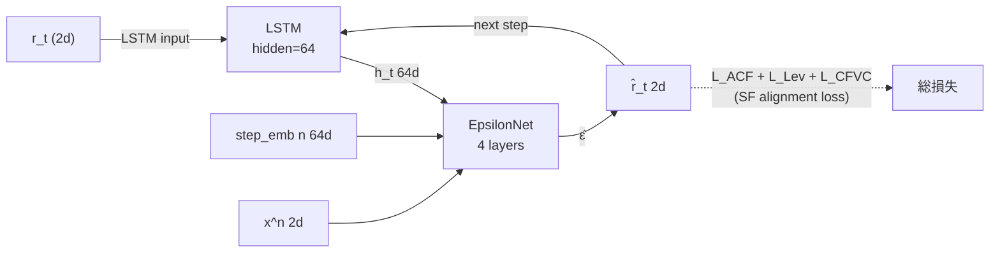

# timegrad_sf — TimeGrad + SFAG-style Stylized Fact Alignment

## アーキテクチャ



*timegrad ベースと同一のフォワードパス。追加の SF alignment loss を backward 時に加算。*

## 概要

`timegrad/` をベースに、**Stylized Fact alignment loss** を追加したモデルです。

Zhang et al. "Beyond Visual Realism: Toward Reliable Financial Time Series Generation" (arXiv:2601.12990, 2026) の手法（SFAG）を参考に、生成系列の統計的性質（ボラティリティクラスタリング・レバレッジ効果・クロスタイムスケール相関）が実データに近くなるよう損失関数に正則化項を追加します。

### timegrad との主な違い

| | timegrad | timegrad_sf |
|---|---|---|
| 損失関数 | DDPM MSE loss のみ | DDPM loss + SF alignment loss |
| EpsilonNet 規模 | 8層 hidden=128 (~531K) | 4層 hidden=64 (~103K) |
| SF alignment | なし | L_ACF + L_Lev + L_CFVC |

EpsilonNet を縮小したのは、2次元出力（$R^2 \to R^2$）に対して元のサイズが過剰だったためです。

## ファイル構成

```
timegrad_sf/
├── train.py     # 学習・パス生成 CLI
├── dataset.py   # データ読み込み・正規化・ウィンドウ化
├── model.py     # LSTM + EpsilonNet + DDPM スケジューラ
└── sf_loss.py   # Stylized Fact alignment loss (L_ACF, L_Lev, L_CFVC)
```

## 学習

```bash
python timegrad_sf/train.py train \
    --csv output.csv \
    --epochs 50
```

SF loss を無効にして base TimeGrad と同じ損失で学習する場合：

```bash
python timegrad_sf/train.py train --csv output.csv --sf_weight 0
```

### 学習オプション

| オプション | デフォルト | 説明 |
|---|---|---|
| `--csv` | `output.csv` | 学習データ CSV |
| `--epochs` | `200` | エポック数 |
| `--context_length` | `252` | RNN に与える過去の営業日数（約1年） |
| `--pred_length` | `21` | 1サンプルあたりの学習予測長（約1ヶ月） |
| `--stride` | `1` | ウィンドウ開始位置の選択間隔 |
| `--val_method` | `chronological` | val 分割方式: `chronological`=末尾固定 / `random_disjoint`=ターゲット期間が重複しないランダム選択 |
| `--seed` | `42` | `random_disjoint` 時のランダムシード |
| `--batch` | `64` | バッチサイズ |
| `--lr` | `1e-3` | 学習率 |
| `--diff_steps` | `100` | DDPM の拡散ステップ数 |
| `--rnn_hidden` | `64` | LSTM の隠れ次元 |
| `--hidden_dim` | `64` | EpsilonNet の隠れ次元 |
| `--n_layers` | `4` | EpsilonNet の残差ブロック数 |
| `--dropout` | `0.1` | Dropout 率 |
| `--ckpt` | `timegrad_sf/ckpt_best.pt` | チェックポイント保存先 |
| `--sf_weight` | `1.0` | SF loss の全体重み $\lambda_\text{max}$（0 で無効） |
| `--sf_warmup` | `0.2` | SF loss を線形ウォームアップするエポック割合 |
| `--w_acf` | `1.0` | $\mathcal{L}_\text{ACF}$ の重み $\lambda_1$ |
| `--w_lev` | `1.0` | $\mathcal{L}_\text{Lev}$ の重み $\lambda_2$ |
| `--w_cfvc` | `1.0` | $\mathcal{L}_\text{CFVC}$ の重み $\lambda_3$ |
| `--w_kurt` | `0.0` | $\mathcal{L}_\text{kurt}$ の重み $\lambda_4$（0 で無効） |

## 学習ログの見方

```
epoch    1/200  train=0.72 (ddpm=0.69 sf=0.03 w=0.010)  val=0.70
```

| 項目 | 内容 |
|---|---|
| `train` | 学習データでの全損失 |
| `ddpm` | DDPM ノイズ予測 MSE loss |
| `sf` | Stylized Fact alignment loss（重み適用前の値） |
| `w` | 現エポックの SF loss 重み（ウォームアップで増加） |
| `val` | 検証データでの DDPM loss。モデルの汎化性能の指標 |

`val` が下がり続ける → 汎化が改善。`train` だけ下がり `val` が上昇し始める → 過学習。チェックポイントは `val` が最小を更新したときのみ保存されます。

## パス生成

```bash
python timegrad_sf/train.py generate \
    --ckpt timegrad_sf/ckpt_best.pt \
    --csv output.csv \
    --n_paths 1 \
    --business_days 504 \
    --out timegrad_sf/generated_paths.csv
```

| オプション | デフォルト | 説明 |
|---|---|---|
| `--ckpt` | `timegrad_sf/ckpt_best.pt` | 使用するチェックポイント |
| `--csv` | `output.csv` | 正規化統計・RNN コンテキスト用の実績 CSV |
| `--n_paths` | `100` | 生成するパス本数 |
| `--business_days` | `504` | 生成する営業日数（252 ≈ 1年、504 ≈ 2年） |
| `--out` | `timegrad_sf/generated_paths.csv` | 出力 CSV ファイル名 |

出力形式は `diffusion` / `timegrad` と同一のため、`compare_paths.py` でそのまま可視化できます。

## モデルアーキテクチャ

```
TimeGradSFModel
├── LSTM (input_dim=2, hidden_dim=rnn_hidden)
│     過去のリターン列 x_{1:t-1} を処理して hidden state h_t を生成
└── EpsilonNet ε_θ(x^n, n, h_t)
      Input : x^n ∈ R^2 (noisy return), n (拡散ステップ), h_t (LSTM hidden)
      Condition = cat([sinusoidal(n), h_t])
      Hidden: Linear → N × ResidualBlock (FiLM conditioning)
      Output: ε̂ ∈ R^2 (予測ノイズ)

学習: teacher forcing で context → targets を一括処理
      DDPM loss + SF alignment loss の合算
生成: 1ステップごとに DDPM reverse → LSTM 更新 の自己回帰ループ
```

---

## 損失関数（数式）

### 全体の学習目標

$$\mathcal{L} = \mathcal{L}_\text{DDPM} + \lambda(e)\bigl(\lambda_1\mathcal{L}_\text{ACF} + \lambda_2\mathcal{L}_\text{Lev} + \lambda_3\mathcal{L}_\text{CFVC} + \lambda_4\mathcal{L}_\text{kurt}\bigr)$$

$\lambda(e)$ はエポック $e$ における SF loss の全体重みで、線形ウォームアップで増加します：

$$\lambda(e) = \lambda_\text{max} \cdot \min\!\left(1,\; \frac{e}{e_\text{warmup}}\right)$$

ウォームアップの理由：学習初期は $\hat{\varepsilon}$ がランダムに近く Tweedie 推定 $\hat{x}^0$ が不正確なため、SF 損失の勾配が乱れる。DDPM loss がある程度収束してから SF 損失を加えることで学習を安定させる。

---

### DDPM 損失

$$\mathcal{L}_\text{DDPM} = \mathbb{E}_{n,\varepsilon}\!\left[\|\varepsilon - \hat{\varepsilon}_\theta(x^n, n, h_t)\|^2\right]$$

- $x^n = \sqrt{\bar{\alpha}_n}\,x^0 + \sqrt{1-\bar{\alpha}_n}\,\varepsilon$（前向き拡散）
- $n \sim \mathrm{Uniform}(0, N-1)$,  $\varepsilon \sim \mathcal{N}(0, I)$

---

### Tweedie 推定（$\hat{x}^0$）

SF 損失は生成系列の統計量と実データの統計量を比較する必要がある。DDPM の forward pass から $\hat{\varepsilon}$ が得られるので、$\hat{x}^0$ を追加の生成コストなしに計算できる：

$$\hat{x}^0 = \frac{x^n - \sqrt{1-\bar{\alpha}_n}\;\hat{\varepsilon}}{\sqrt{\bar{\alpha}_n}}$$

---

### シーケンスの構成

SF 統計量は**コンテキスト（実データ）＋予測**の全体 $T_\text{ctx} + T_\text{pred}$ 日で計算する：

$$\underbrace{x_1,\ldots,x_{T_c}}_{\text{context（実データ）}} \;\Big\|\; \underbrace{\hat{x}^0_{T_c+1},\ldots,\hat{x}^0_{T_c+P}}_{\text{Tweedie 推定}}$$

参照系列（実データ）：$[x_1,\ldots,x_{T_c},\; x^0_{T_c+1},\ldots,x^0_{T_c+P}]$

コンテキストは両系列で共通（実データ）なので、差は最後の $P$ ステップのみ。ACF・Pearson 相関はスケール不変なので正規化済みリターンのまま計算できる。

---

### $\mathcal{L}_\text{ACF}$：ボラティリティ・クラスタリング

二乗リターン $r^2$ の lag-$k$ 自己相関の MSE（$K=20$、sp500・DGS10 両方）：

$$\mathcal{L}_\text{ACF} = \frac{1}{K \cdot D}\sum_{d=1}^{D}\sum_{k=1}^{K}\bigl[\rho_k(r_d^2) - \rho_k(\hat{r}_d^2)\bigr]^2$$

---

### $\mathcal{L}_\text{Lev}$：レバレッジ効果

株式リターンの下落が将来のボラティリティを上昇させる負の相関（sp500 のみ）：

$$\mathcal{L}_\text{Lev} = \left|\,\mathrm{corr}(r_t,\; \sigma_{t+1:t+W}) - \mathrm{corr}(\hat{r}_t,\; \hat{\sigma}_{t+1:t+W})\,\right|$$

$\sigma_{t+1:t+W} = \mathrm{std}(r_{t+1},\ldots,r_{t+W})$：$W=20$ 日間の実現ボラティリティ

---

### $\mathcal{L}_\text{CFVC}$：クロスタイムスケール・ボラティリティ相関

複数の時間スケールのローリングボラティリティ間の相関構造を合わせる（sp500）：

$$\mathcal{L}_\text{CFVC} = \left\|\,\mathrm{Corr}(\Sigma) - \mathrm{Corr}(\hat{\Sigma})\,\right\|_F$$

$\Sigma$：時間スケール $\{5, 20, 60, 120\}$ 日のローリングボラティリティを縦に並べた行列、$\|\cdot\|_F$：Frobenius ノルム

---

### $\mathcal{L}_\text{kurt}$：ファットテール（尖度）

Pearson 尖度の差（デフォルト無効、`--w_kurt` で有効化）：

$$\mathcal{L}_\text{kurt} = \left|\,\frac{\mu_4(\hat{r})}{\sigma^4(\hat{r})} - \frac{\mu_4(r)}{\sigma^4(r)}\,\right|$$

sp500（$d=0$）の全系列（コンテキスト＋予測）で計算。勾配は予測した21ステップ分の寄与から流れる。
